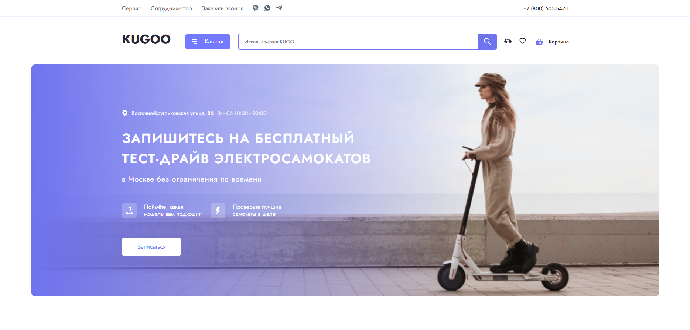
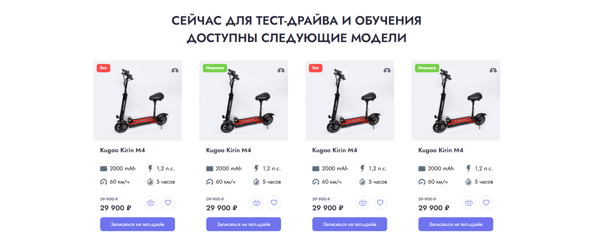
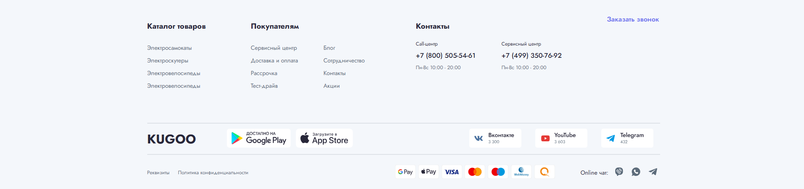

# Kugoo — Multi-Page Website for Electric Scooter Brand

A multi-page, responsive website created as a diploma project.  
Designed to look like a real commercial website for an electric scooter brand.  
Clean structure, modern layout, reusable blocks and fully responsive pages.

## ⭐ Features

- Multi-page website with a clean, scalable structure
- Modern and stylish UI with accent branding
- Fully responsive (mobile, tablet, desktop)
- Product sections, catalog, features and brand info
- Interactive elements built with JavaScript
- Reusable header and footer components
- Clean and organized asset structure (`css`, `js`, `img`, `fonts`)

## 🛠 Tech Stack

- **HTML5**
- **CSS3** (flexbox, grid, adaptive layout)
- **JavaScript (Vanilla)**
- **Responsive design principles**
- **BEM / semantic layout**

## ✔ What I focused on

- Pixel-perfect layout from design  
- Clean and readable CSS structure  
- Fast layout without heavy libraries  
- Proper spacing, typography, and visual hierarchy  
- Creating a branded feel through colors and UI accents  
- Optimizing images and file structure  

## 📂 Project Structure
## 📸 Preview

